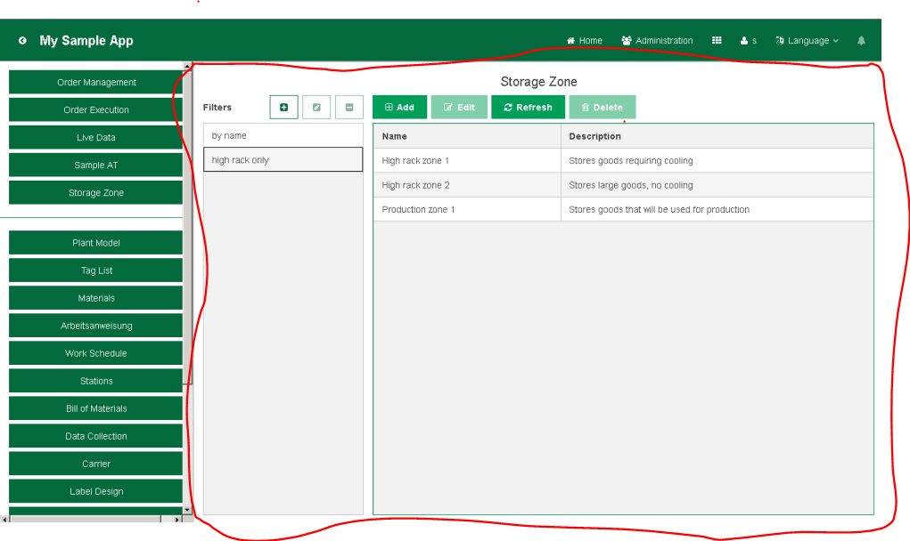

# MF WEBSDK 3.2 Dev Guide

###  Using the Class Descriptor-Based Components 

- 图中红色方框内就是Class Descriptor-Based Components

1. The object panel is implemented as a view derived from BaseView using the
following framework classes and interfaces:
- IUIClassDescriptor, IUIClassDescriptorFactory, and UIApplicationDomain
	- To obtain an IUIClassDescriptor instance for a model object class, *inject the
IUIClassDescriptorFactory instance into your view.*
	- When you query the factory for the class descriptor, you need to pass it to a **UIApplicationDomain** instance in addition to the Java class representing the model objects
	- Each FFP application should define its own main domain
	- This allows an FFP application to use its own class descriptors for a particular model object. With this approach, an application can display different properties of a model object compared to other applications.
	- Additionally, when you perform a query, you should always use an application-specific domain even if you know that the descriptor has been registered for the root domain
- RALazyQueryBeanItemContainer or RABeanItemContainer
- BeanTable——takes advantage of the **RA...BeanItemContainer** data sources
- ActionToolbar and (I)RAAction