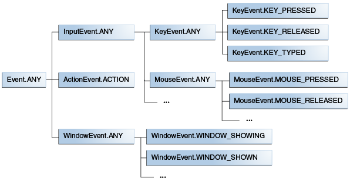

1. 在JavaFX中，事件是javafx.event.Event类或其任何子类的实例。JavaFX提供了多种事件，包括**DragEvent**、**KeyEvent**、**MouseEvent**、**ScrollEvent**等。

|属性|描述|
|----|-----|
|事件类型(Event type)|发生事件的类型|
|源(Source)|事件的来源，表示该事件在事件派发链中的位置。事件通过派发链传递时，“源”会随之发生改变|
|目标(Target)|发生动作的节点，在事件派发链的末尾。“目标”不会改变，但是如果某个事件过滤器在事件捕获阶段消费了该事件，“目标”将不会收到该事件|

2. 事件类型层级机构

### 事件目标
3. `buildEventDispatchChain`方法的具体实现创建了**事件派发链**，事件必须经过该派发链到达事件目标。  
Window、Scene和Node类均实现了*EventTarget接口*，这些类的子类也均继承了此实现。因此，在你的UI中的大多数元素都有它们已经定义好了的派发链，这使得你可以聚焦在如何响应事件上而不必关心创建事件派发链的事情。
### 事件处理
4. 事件处理功能由Event Filter和Event Handler提供，两者均是*EventHandler*接口的实现。Event Filter和Event Handler之间主要区别在于**两者被执行的时机不同**。
- Event Filter在**事件捕获阶段**执行。父节点的事件过滤器可以为多个子节点提供公共的事件处理，并且如果需要的话，也可以消费掉事件以阻止子节点收到该事件。当某事件被传递并经过注册了Event Filter的节点时，为该事件类型的注册的Event Filter就会被执行。
    - 一个节点可以注册多个Event Filter。
    - Event Filter执行的顺序取决于事件类型的层级关系。
- Event Handler在事件冒泡阶段执行。如果子节点的Event Handler未消耗掉对应的事件，那么父节点的Event Handler就可以在子节点处理完成以后来处理该事件，并且父节点的Event Handler还可以为多个子节点提供公共的事件处理过程。当某事件返回并经过注册了Event Handler的节点时，为该事件类型注册的Event Handler就会被执行。
### 事件消费
5. 事件可以被Event Filter或 Event Handler在事件派发链中的任意节点上通过调用consume()方法消耗掉。该方法表示事件的处理已经完成，并且事件派发链的遍历也应该终止。  
在Event Filter中消费掉对应的事件会阻止事件派发链上的任何子节点再响应该事件。在Event Handler中消费掉对应的事件会阻止事件派发链中的任何父处理器再处理该事件。但是，如果消费掉该事件的节点为该事件注册了多个Event Filter或者Event Handler，这些同级的Event Filter或者Event Handler仍然会被执行。
---
### 快捷方法
6. 许多快捷方法都定义在Node类中，并且这些方法对Node的所有子类也都是可用的 

|用户动作	|事件类型	|所在类|
|----------|-----------|-----------|
|按下键盘上的按键|	KeyEvent|	Node、Scene|
|移动鼠标或者按下鼠标按键|	MouseEvent|	Node、Scene
|执行完整的“按下-拖拽-释放”鼠标动作|	MouseDragEvent|	Node、Scene
|在一个节点中，底层输入法提示其文本的改变。编辑中的文本被生成/改变/移除时，底层输入法会提交最终结果，或者改变插入符位置。|	InputMethodEvent|	Node、Scene
|执行受所在平台支持的拖拽动作|	DragEvent|	Node、Scene
|滚动某对象|	ScrollEvent	|Node、Scene
|在某对象上执行旋转手势|	RotateEvent|	Node、Scene
|在某对象上执行滑动手势|	SwipeEvent|	Node、Scene
|触摸某对象|	TouchEvent|	Node、Scene
|在某对象上执行缩放手势|	ZoomEvent	|Node、Scene
|请求上下文菜单|	ContextMenuEvent|	Node、Scene
|按下按钮、显示或隐藏组合框、选择菜单项|	ActionEvent	|ButtonBase、ComboBoxBase、ContextMenu、MenuItem、TextField
|编辑列表、表格或者树的子项|	ListView.EditEvent | ListView 
|编辑列表、表格或者树的子项|TableColumn.CellEditEvent| TableColumn 
|编辑列表、表格或者树的子项|TreeView.EditEvent |TreeView
|媒体播放器遇到错误|	MediaErrorEvent	|MediaView
|菜单被显示或者隐藏|	Event	|Menu
|弹出式窗口被隐藏|	Event	|PopupWindow
|选项卡被选择或者关闭|	Event	|Tab
|窗口被关闭、显示或者隐藏|	WindowEvent	|Window
## 事件过滤器(Event Filter)
7. Event Filter使你可以在事件处理过程中的事件捕获阶段来处理事件。
- 一个节点可以有一个或多个Event Filter来处理一个事件。
- 一个Event Filter可以被多个节点使用并可以处理多种不同的事件类型。
- Event Filter使父节点可以为所有的子节点来提供通用的事件处理或者是拦截住事件以使子节点不再响应该事件。
8. Event Filter是*EventHandler接口*的一个实现。该接口的handle()方法提供了当对应节点接收到与Event Filter关联的特定事件时需要被执行的代码。
## 事件处理器(Event Handler)
9. Event Handler使你可以在事件处理的事件冒泡(Event Bubbling)阶段来处理事件。
- 一个节点可以有一个或多个用来处理事件的Event Handler。
- 一个Event Handler可以被多个节点使用，并且可以处理多种不同的事件类型。
- 如果子节点的Event Handler没有消耗掉对应的事件，则父节点的Event Handler可以使父节点在子节点处理完事件之后继续对事件作出响应，并且为多个子节点提供通用的事件处理机制。
## 使用可触摸设备的事件
# *跳过*

## 处理触摸事件
# *跳过*