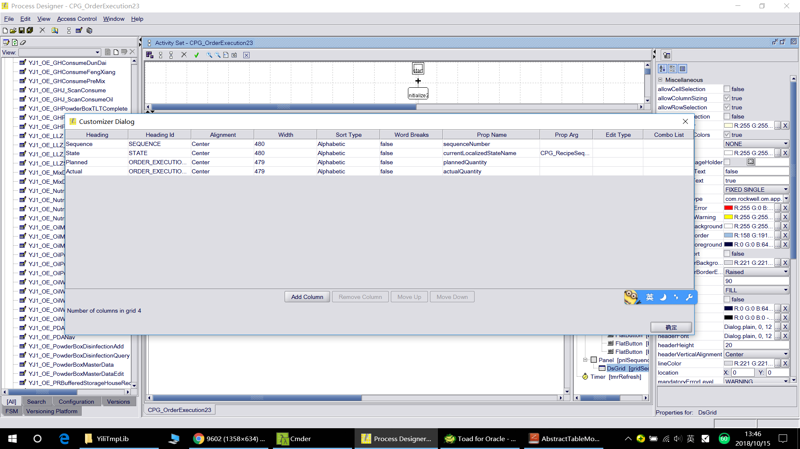

 ## CPG DEV Log
### 1.```RuntimeMFC```的```getType()```方法返回类型：
- 1 = Input
- 2 = Transfer
- 3 = Output
- 4 = Co-Product
- 5 = By-Product
### 2.RuntimeMFC的获取
```
    runtimeMFCs=controlRecipe.getRuntimeMFCs()
    foreach runtimeMFC(runtimeMFCs){

    }
```

### 3.FTPC对象与CPG对象之间的连接

- ```com.rockwell.om.app.utility.RecipeResourceSet```
    - Code
    ```java
    RecipeResourceSet::getRecipeResourceSet(controlRecipe)
    recipeResources=recipeResourceSet.getRecipeResources()
    ```
- ```com.rockwell.om.app.utility.RecipeSequence```
    - Code
    ```Java
    //Create
    RecipeSequence::createRecipeSequence(com.datasweep.compatibility.client.ProcessStepControlRecipe pscr, com.datasweep.compatibility.client.MeasuredValue plannedQuantity)

    RecipeSequence::getProcessSteps(com.datasweep.compatibility.client.ProcessStepControlRecipe pscr, int sequenceNumber)

    RecipeSequence::getRecipeSequence(com.datasweep.compatibility.client.ProcessStepControlRecipe pscr, int sequenceNumber)

    RecipeSequence::getRecipeSequence(com.datasweep.compatibility.client.ProcessStepControlRecipe pscr, int sequenceNumber, java.lang.String relationshipName, java.lang.String expectedStateName)
    ```
### 4.FormCntrl23Activity中使用Form，Form中的smartEdit需要设置**alternativeEditorSupportClass**
- MeasuredValue ```com.datasweep.plantops.property.editor.MeasuredValuePropertyEditor```
- String
    - ```com.rockwell.om.control.ReadOnlyStringPropertyEditor```
    - ```com.datasweep.plantops.property.editor.StringPropertyEditor```
- Time
### 5.获取**ProcessStepControlRecipe**
```Java
// 0 ControlRecipe
// 1 ProcessStepControlRecipe
processStepControlRecipe = processOrderItem.getRuntimeRecipe(1)
```
### 6.获取**processStep**的消耗/产出物料
```
mis = processStep.getProcessStepMaterialInfos()
```
### 7.根据工作中心获取该工作中心的工序、消耗产出物料（该代码为失败代码）
```java
function calculatePartRequest(){
    itemProcessOrder=getFormProperty("processOrderItem")
    if(itemProcessOrder==null){
        processOrder=getProcessOrderByName("20180703002")
        itemProcessOrder=processOrder.getProcessOrderItems()[0]
    }
    
    orderName=itemProcessOrder.getOrderName()
    controlRecipe = itemProcessOrder.getRuntimeRecipe(1)
        
    runtimeMFCs=controlRecipe.getRuntimeMFCs()
    foreach runtimeMFC(runtimeMFCs){
        if(runtimeMFC.getType()==1){
        materialName = runtimeMFC.getPartNumber()
        materialDesc = runtimeMFC.getPartDescription()
        mvPlanQty = runtimeMFC.getQuantity()
        println(materialName+"\t"+materialDesc+"\t"+mvPlanQty+"\t"+runtimeMFC.getType())
        }
    }
     
    processSteps = controlRecipe.getProcessSteps()
//     foreach processStep(processSteps){
//         //println(processStep.getRouteStep().getName())
//         
//         if(processStep.getRouteStep().getWorkCenters().contains(workCenter40)||
//         processStep.getRouteStep().getWorkCenters().contains(workCenter50)){
//             println(processStep.getRouteStep().getName())
//         }
//     }
    
    
    recipeResourceSet=RecipeResourceSet::getRecipeResourceSet(controlRecipe)
    recipeResources=recipeResourceSet.getRecipeResources()
    foreach  recipeResource(recipeResources){
        if(recipeResource.getWorkCenter().getName()==workcenter01 ||
        recipeResource.getWorkCenter().getName()==workcenter02){
            println(recipeResource.getResourceObjectDescription())
        }
    }
    
}
```

8. DsGrid绑定`com.rockwell.om.app.utility.RecipeSequence`时，RecipeSequence的状态显示，标准功能配置如下：
   
- *Prop Arg* 配置FSM:**CPG_RecipeSequence**
- *Prop Name*配置为**currentLocalizedStateName**
- 【问题】**currentLocalizedStateName**无法从下拉框获取，`RecipeSequence`只有状态**currentStateName**，要实现*Prop Name*配置从而状态能够根据Localization变化，需要代码：
  ```Java
  colummnDef= gridSequence.getColumnDefinitions()
  colummnDef[1].setBoundObjectPropName("currentLocalizedStateName")
  gridSequence.setColumnDefinitions(colummnDef)
  ```