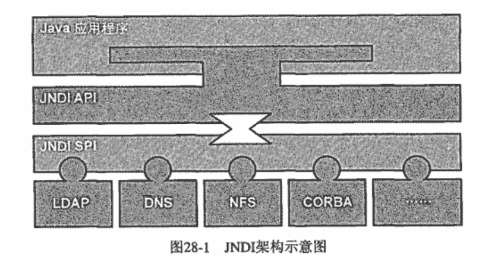

### Chapter 28 Spring与JNDI

1 JNDI(Java Naming and Directory Interface)

- JNDI API——公开给Java程序使用
- JNDI SPI——公开给Vendor使用，Vendor根据SPI规范提供自己产品的对应实现

2 J2EE平台上，JNDI更多是为资源的访问和部署提供一个“隔离层”。
- 大多时候，使用J2EE应用服务器提供的JNDI实现

3 **JNDITemplate**

4 ```org.springframework.jndi.JndiObjectFactoryBean```
- FactoryBean that looks up a JNDI object. Exposes the object found in JNDI for bean references, e.g. for data access object's "dataSource" property in case of a DataSource.
### Chapter 29 Spring与JMS

