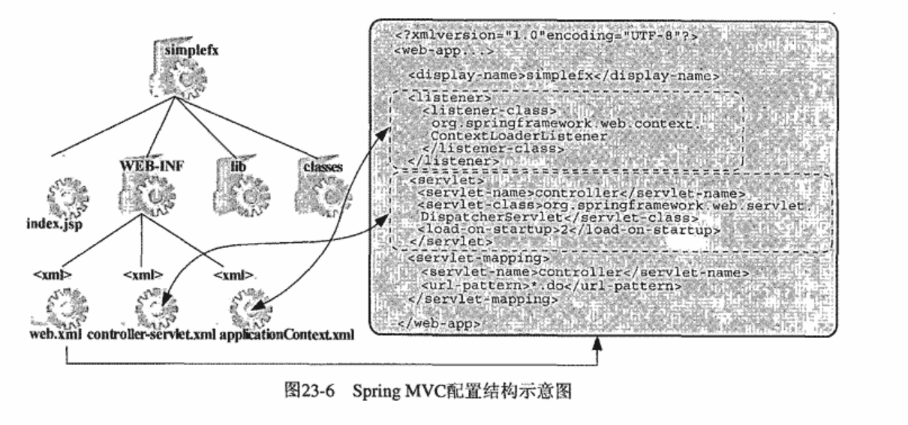
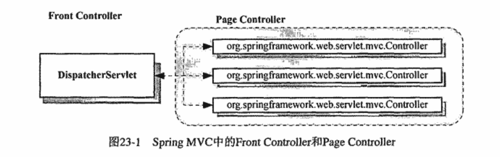
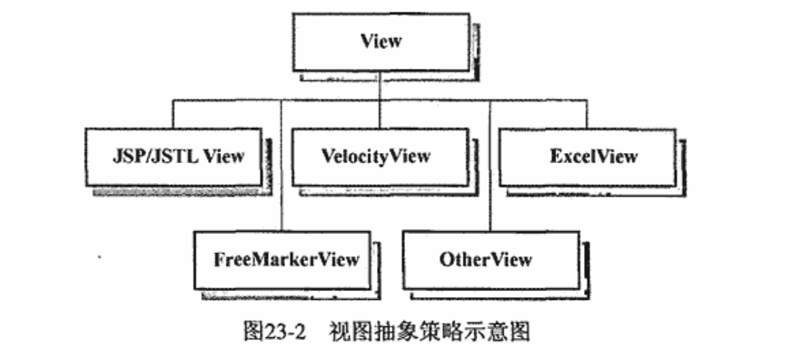
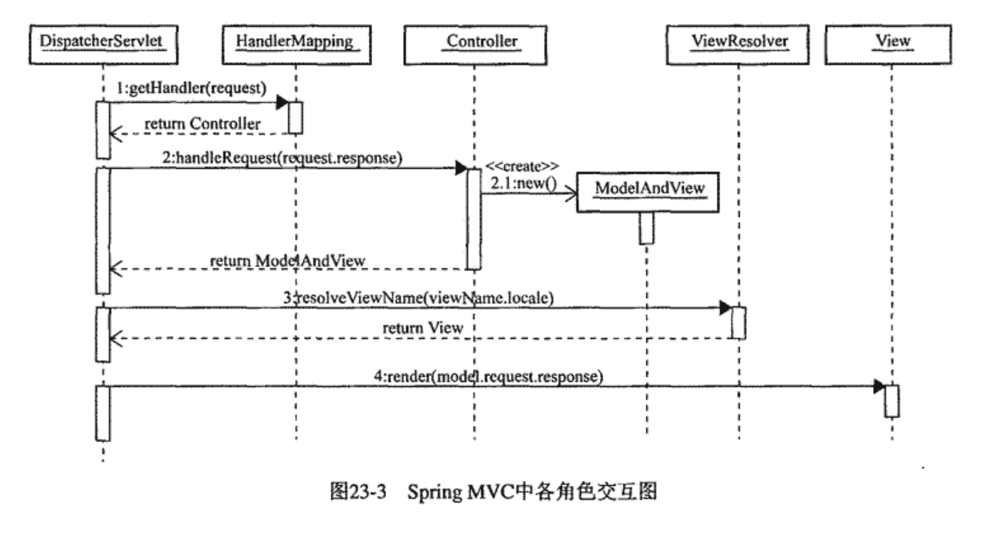
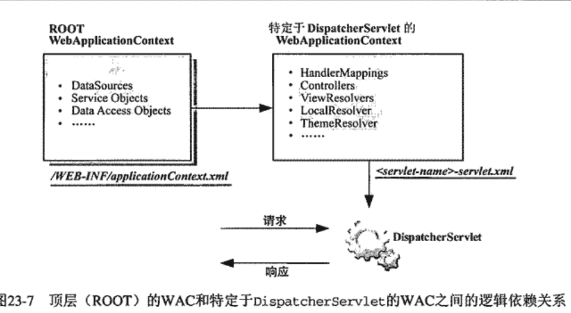
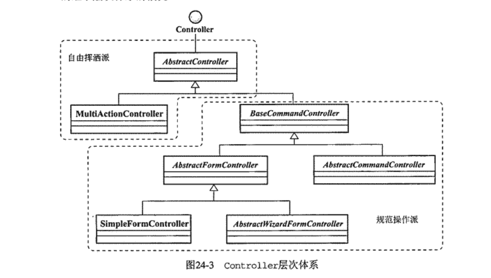
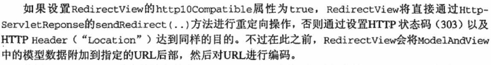

## Spring揭秘-Spring MVC
### Chapter 22
1.Web框架类型：
- 请求驱动类型——Struts、Spring MVC
- 事件驱动类型——JSF(Java Server Faces，Asp.net)

### Chapter 23
1.目录结构

2.Controller结构
		
3.DispatcherServlet处理流程：
- ```org.springframework.web.servlet.HandlerMapping```专门管理Web请求与处理类之间的Mapping映射关系
- ```org.springframework.web.servlet.mvc.Controller```Web请求的实际处理者
	- 返回```org.springframework.web.servlet.ModelAndView```实例
- ViewResolver和View
	- View
		
	- ```org.springframework.web.servlet.View```接口，统一抽象视图的生成策略
- 结构图
	
- WebApplicationContext
	
2.对于前端Jsp，可以使用**DisplayTag**、**eXtrmeTable**等开源TagLib减少数据表格的实现工作量
### Chapter 24
1.HandlerMapping
-  HandlerMapping是接口，实现类：
	- BeanNameUrlHandlerMapping——视图模版中的请求路径和容器中Handler的beanName一致
	- SimpleUrlHandlerMapping
	-  ControllerClassNameHandlerMapping
	-  DefaultAnnotationHandlerMapping
- HandlerMapping的优先级规定遵循Spring Ordered接口的语义
2.Controller
	
- 以**BaseCommandController**为基类规范操作派：
	- 自动抽取request参数并绑定到Command
	- 统一的数据验证方式，```org.springframework.validation.Validator```
	- 规范化表单(Form)的处理流程
- **AbstractController**，通过模版方法模式解决通用的关注点：
	- 管理当前Controller所支持的请求类型(GET/POST)
	- 管理页面的缓存设置，即是否允许浏览器缓存当前页面
	- 管理执行流程在Session上的同步

### BaseCommandController及其之类在Spring 3及之上中都已取消
3.Spring数据验证框架
- 核心类```org.springframework.validation.Validator```——实现具体验证逻辑
- 核心类```org.springframework.validation.Errors```——承载验证中出现的错误信息

3.ModelAndView
- 使用**ViewResolver**根据逻辑视图名(String)获取View实例
- 使用```org.springframework.ui.ModelMap```保持模型数据

4.**ViewResolver**
- BeanNameViewResolver
- AbstractCachingViewResolver

4.1、面向单一视图类型的实现类
- 基类**UrlBasedViewResolver**
- InternalResourceViewResolver
- FreeMarkerViewResolver/VelocityViewResolver/JasperReportsViewResolver
 ### Spring 5已取消支持
- XsltViewResolver
- TilesViewResolver

4.2、面向多视图类型的实现类
- ResourceBundleViewResolver
	- 使用ResourceBundle的国际化支持能力，唯一提供视图国际化支持的ViewResolver
	- 逻辑视图与物理视图的映射关系保存在Properties文件中，格式符合Spring Ioc容器的Properties配置格式
- XmlViewResolver
	- 与ResourceBundleViewResolver区别是ResourceBundleViewResolver使用Properties文件，XmlViewResolver使用符合Spring Ioc 的XML格式
- BeanNameViewResolver
	- 直接将View实例注册到DispatcherServlet所使用的WebApplicationContext中
	- 用于快速搭建系统原型

5.View
- 基类```AbstractView```
- 基类```AbstractUrlBasedView```
- Jsp的View实现
	- InternalResourceView
	- JstlView
	- TilesView
- FreeMarkerView/VelocityView
### Spring 5已取消支持
- 二进制文档格式
	- AbstractExcelView——使用Apache POI构建Excel
	- AbstractJExcelView——使用JExcel API
	- AbstractPdfView——使用OpenPDF
- JasperReports的View实现
	- JasperReportsCsvView
	- JasperReportsHtmlView
	- JasperReportsPdfView
	- JasperReportsXlsView
- AbstractXlsView
- RedirectView——对指定的Url重定向
	
	- 简便方法：在逻辑视图名中使用redirect/forward前缀