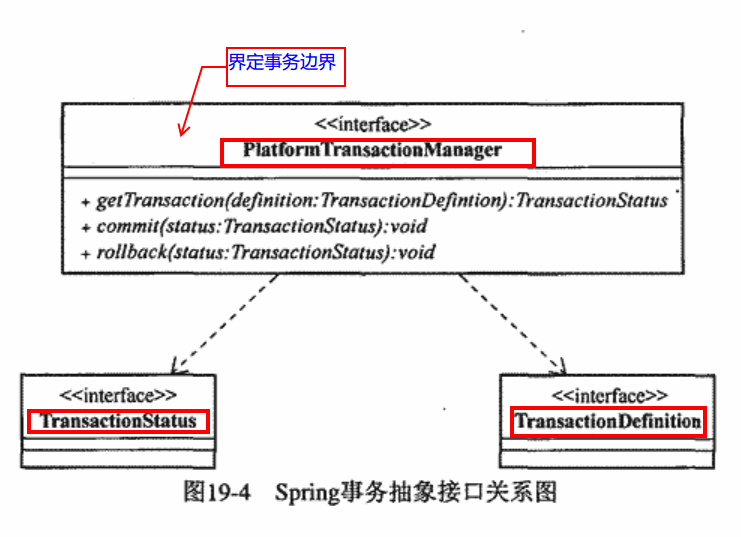

### Chapter 17 事务概念

 1. 基本特性
 - 原子性
 - 一致性
 - 持久性
 - 隔离性。4种类型的隔离级别（从弱到强）：
	 - Read Uncommitted
	 - Read Committed
	 - Repeatable Read
	 - Serializable

2.典型事务处理的参与者：
- Resource Manager（**RM**）——负责存储并管理系统数据资源的状态
- Transaction Processing Monitor（**TP Monitor**）——在分布式事务场景中协调包含多个RM的的事务处理
- Transaction Manager——TP Monitor中的核心模块，直接负责多RM之间事务的协调
- Application——事务边界的触发点

3.事务分类
- 全局事务——多RM参与
- 局部事务——只有一个RM
### Chapter 18 Java的事务管理
1.Java平台的局部事务支持

	通过当前使用的数据访问技术所提供的基于**connection**的API管理事务
- 消息服务资源——通过JMS的javax.jms.session控制整个事务

2.Java平台的分布式事务
- JTA（**Java Transaction API**）
	- JTA是Sun提出的标准化分布式事务访问的接口规范。
	- 具体实现由供应商提供
- JCA（**Java Connector Architecture**）——面向EIS（Enterprise Information System）的集成，通过为遗留EIS系统和Java EE应用服务器制定统一的通信标准，二者可以实现服务上的互通
### Chapter 19 Spring事务架构
1.**基本原则**：事务管理的关注点和数据访问关注点**相分离**
2.**DataSourceUtils**对connection的管理：```org.springframework.jdbc.datasource.DataSourceUtils```从```org.springframework.transaction.support.TransactionSynchronizationManager```获取connection资源。如果当前线程之前没有绑定connection资源，通过数据访问对象的datasource获取新的connection，否则使用绑定的connection
3.基础结构

- TransactionDefinition
- TransactionStatus
- PlatformTransactionManager