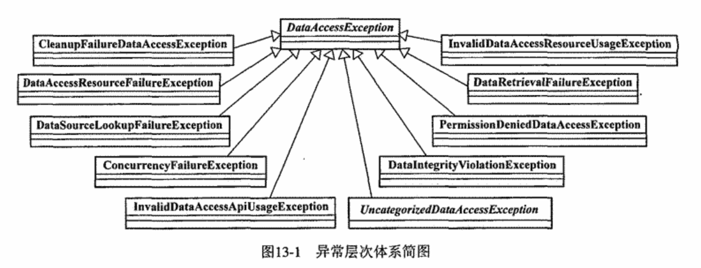

### Chapter 13 统一的数据访问异常体系

 1. 语义完整的异常体系定义
 2. Spring数据访问异常体系
 
 
 ### Chapter 14 JDBC API
 
#### 基于Template的JDBC
 1. 使用```org.springframework.jdbc.core.JdbcTemplate```作为数据访问的**Helper**类
 	- 封装了所有基于JDBC的数据访问代码，以统一的格式和规范使用JDBC API
 	- 对SQLException所提供的异常信息在框架内统一转译，将基于JDBC的数据访问异常纳入Spring自身的异常层次体系

 2.设计模式中**模版方法模式**