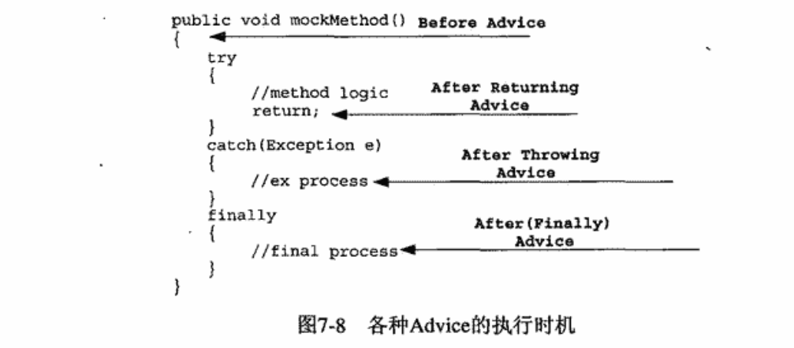
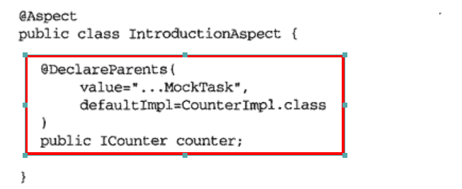

## Spring揭秘

### Chapter 7 一起来看AOP
#### 1.静态AOP

 - 代表 **AspectJ**
 - 相应的横切关注点以以Aspect形式实现以后，通过特定的编译器将实现后的Aspect编译并织入到系统的静态类。
 - 优点：Aspect直接以Java字节码的形式编译到Java类中。JVM可以向往常一样加载Java类运行
 - 缺点：不够灵活。每次修改都要使用编译器重新编译Aspect并重新织入到系统

#### 2.动态AOP
- JBoss AOP，Spring AOP，Nanning以及AspectJ
- 大都采用Java实现，AOP各种概念实体都是Java类。
- AOP的织入是在系统运行开始之后，而不是预先编译到系统类，织入信息采用外部XML保存，可以调整织入模块及织入点而不必变更系统其他模块

#### 3.术语
- Joinpoint
 类型：
	- 方法调用
	- 方法调用执行
	- 构造方法调用
	- 构造方法调用执行
	- 字段设置
	- 字段获取
	- 异常处理执行
	- 类初始化——类中某些静态类或静态块初始化的点
- Pointcut
  表述方式：
	- 直接指定Joinpoint所在方法名称
	- 正则表达式
	- 特定的Pointcut表述语言
	
 	Pointcut之间可以执行逻辑运算
- Advice——单一横切关注点逻辑的载体，代表会织入到Joinpoint的横切逻辑
	- Before Advice-在Joinpoint指定位置之前执行的Advice类型
	- After Advice
		- After Returning Advice
		- After throwing Advice
		- After (Finally) Advice

			
	- Around Advice——在Joinpoint之前和之后执行横切逻辑
- **Introduction**——不是根据横切逻辑在Joinpoint的执行时机区分的，而是根据它可以完成的功能而区分其他Advice类型
	- 可以为原有的对象增加新的特性或行为

### Chapter 8 Spring AOP概述及其实现机制
如果Spring AOP发现目标对象实现了相应接口（	```InvocationHandler```）,采用Java动态代理机制为其生成代理对象实例
如果目标对象没有实现相应接口，Spring AOP使用**CGLib**的开源字的动态节码生成库生成代理对象实例
### Chapter 9 Spring AOP一世

### Chapter 10 Spring AOP二世

 1. Spring AOP只是使用AspectJ类库进行Pointcut的解析和配置，最终实现机制还是Spring AOP代理模式
 2. 使用的Jar包
	 - aspectjweaver.jar
	 - aspectjrt.jar
#### **使用到的注解**
 3. ```@Aspect```
 4. ```@Pointcut```,包含
	 - Pointcut Expression——规定Pointcut匹配规则
	 - Pointcut Signature——具体化为方法定义，唯一的限制是*返回类型必须是void*
		 - 可以将Pointcut Signature作为Pointcut Expression的标志符，在Pointcut Expression的定义中取代重复的Pointcut表达式定义
	- Spring AOP可以使用的Pointcut表达式
		- execution-指定要匹配的方法
		- within-声明类型，匹配指定类型下的所有JoinPoint(方法)
		- this和target
			- this——目标对象的代理对象
			- target——目标对象
		- args——帮助捕捉拥有指定参数类型、参数数量的方法级JoinPoint
		- @within——效果和within一样，不过@within的参数是注解——即所有被注解的类中的方法都是JoinPoint
		- @target
		- @args
		- @annotation
 5. @AspectJ形式声明的Pointcut表达式，在Spring AOP内部解析会转换为专门面向AspectJ的Pointcut实现-**AspectJExpressionPointcut**
 6. @AspectJ形式的Advice
	 - @Before
		 - 如何访问在Advice定义中访问Joinpoint的参数
	- @AfterReturning
	- @AfterThrowing
	- @After(finally)
	- @Around
		- 第一个参数必须是org.aspectj.lang.ProceedingJoinpoint类型。通常情况下，需要在Advice中调用ProceedingJoinpoint的proceed()方法继续调用链的执行
	- @DeclareParents-对应Introduction
		
		说明：将ICounter接口（实现类CounterImpl）的行为逻辑加到ITask的实现类MockTask上