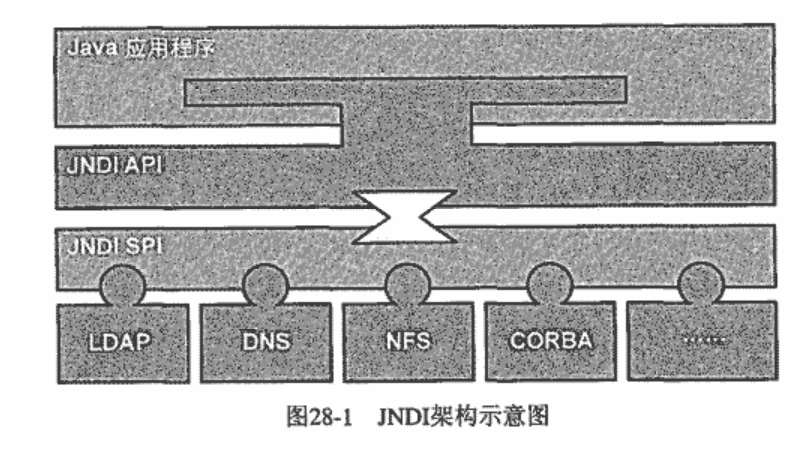

### Chapter 28 Spring与JNDI

1 JNDI(Java Naming and Directory Interface)

- JNDI API——公开给Java程序使用
- JNDI SPI——公开给Vendor使用，Vendor根据SPI规范提供自己产品的对应实现

2 J2EE平台上，JNDI更多是为资源的访问和部署提供一个“隔离层”。
- 大多时候，使用J2EE应用服务器提供的JNDI实现

3 **JNDITemplate**

4 ```org.springframework.jndi.JndiObjectFactoryBean```
- FactoryBean that looks up a JNDI object. Exposes the object found in JNDI for bean references, e.g. for data access object's "dataSource" property in case of a DataSource.

### Chapter 29 Spring与JMS
1 JMS组成
- JMS Client
- non-JMS Client
- Message：StreamMessage、ByteMessage、MapMessage、TextMessage、ObjectMessage
- JMS Provider-符合JMS规范的具体产品：ActiveMQ
- **收管理对象**：提前配置到系统然后再交给JMS类型客户端使用的对象。
    - ConnectionFactory
    - Destination

2 **JmsTemplate**   ```org.springframework.jms.core.JmsTemplate```
- 唯一依赖 JMS的ConnectionFactory

3 JmsTemplate的模版方法划分为三类：
- 消息发送
    - ProducerCallback模版方法(JmsTemplate.execute)
    - 使用MessageCreator模版方法(JmsTemplate.send)
    - 使用MessageConverter模版方法(JmsTemplate.convertAndSend)
- 消息接受
    - 直接接受-receive()
    - 使用MessageSelector接受-receiveSelected()
    - 使用MessageConverter模版方法(JmsTemplate.receiveAndConvert)
    - receiveSelectedAndConvert
- 使用QueueBrower检查消息队列的情况
    - browse(BrowserCallback<T> action)
    - browseSelected(messageSelector, BrowserCallback<T> action)
    - 执行查看的类```javax.jms.QueueBrowser```

4 使用MessageConverter模版方法(JmsTemplate.convertAndSend)的补充
- MessageConverter的默认实现```org.springframework.jms.support.converter.SimpleMessageConverter```
- JmsTemplate.convertAndSend参数中有```MessagePostProcessor```
    - 在消息发送之前对消息做进一步的**后处理**

5 消息发送时可以通过**String**类型执行Destination，Spring使用**DestinationResolver**转换为Destination实例
- DestinationResolver实现类：
    - ```DynamicDestinationResolver```
    - ```JndiDestinationResolver```
    - ```BeanFactoryDestinationResolver```

6 消息异步接受
Spring提供```MessageListenerContainer```，管理实现interface MessageListener的消息驱动POJO对象

**MessageListenerContainer**职责：
- 负责到指定的Destination接受符合处理条件的Message
- 将接受到的Message通过某种策略转发给匹配的MessageListener
- [实现类]```SimpleMessageListenerContainer```——采用JMS规范提供的标准异步消息接收方式接收消息，即通过MessageConsumer.setMessageListener设定用于异步消息处理的MessageListener
- [实现类]```DefaultMessageListenerContainer```——同步接收，和**TaskExecutor**。使用多个线程循环调用同步接收方法。接收到消息在自己的线程内处理
- [实现类]```ServerSessionMessageListenerContainer```——**Spring 3**已废弃

MessageListener的Variant：**SessionAwareMessageListener**——offering not only the received Message but also the underlying JMS Session object. The latter can be used to send reply messages, without the need to access an external Connection/Session, i.e. without the need to access the underlying ConnectionFactory.

**MessageListenerAdapter**——实现interface MessageListener, interface SessionAwareMessageListener<Message>
>Message listener adapter that delegates the handling of messages to target listener methods via reflection, with flexible message type conversion. Allows listener methods to operate on message content types, completely independent from the JMS API.

>By default, the content of incoming JMS messages gets extracted before being passed into the target listener method, to let the target method operate on message content types such as String or byte array instead of the raw Message. Message type conversion is delegated to a Spring JMS MessageConverter. By default, a SimpleMessageConverter will be used. (If you do not want such automatic message conversion taking place, then be sure to set the MessageConverter to null.)

7 JMS异常处理
JMS的JMSException异常体系以**checked exception**为基准，这就要求要么处理异常要么抛出异常。

Spring以JMSException层次结构为基础，但是以**unchecked exception**为基准，定义了Spring自己的JmsException结构


