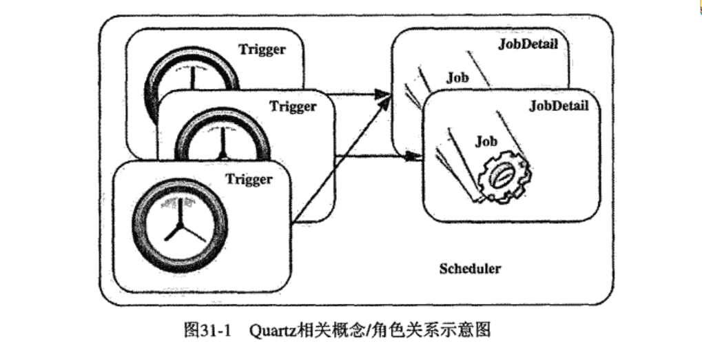
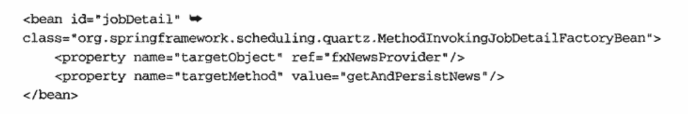

### Chapter 31 Spring中的任务调度和线程池支持
## 1. Quartz
1.1 优点
- 允许批处理状态的持久化，并且提供不同的持久化策略支持
- 批处理任务的远程调度
- 提供基于Web的监控接口
- 集群支持
- 插件式的可扩展性


1.2 使用
- interface Job
- interface Trigger
    - [实现类]```SimpleTriggerImpl```
    - [实现类]```CronTriggerImpl```
- interface Scheduler

2 Spring集成Quartz
- Quartz中，Job执行的上下文由其对应的JobDetail提供,二者通过**JobDataMap**通信
- Spring的改进：Spring提供```org.springframework.scheduling.quartz.QuartzJobBean```.
    -  ### 只在Quartz 1.5之前的版本才有意义。Quartz 1.5之后，使用```SpringBeanJobFactory```
    - **作用**：
>Simple implementation of the Quartz Job interface, applying the passed-in JobDataMap and also the SchedulerContext as bean property values. This is appropriate because a new Job instance will be created for each execution. JobDataMap entries will override SchedulerContext entries with the same keys.

>For example, let's assume that the JobDataMap contains a key "myParam" with value "5": The Job implementation can then expose a bean property "myParam" of type int to receive such a value, i.e. a method "setMyParam(int)". This will also work for complex types like business objects etc.
### - 对于Quartz的JobDetail，Spring提供```JobDetailBean```
- 合理的情况:被调度的业务逻辑应该是独立存在的,不应该因为可能会被调度,就编码到Job实现类中
- 基于上面的问题，Spring提供```org.springframework.scheduling.quartz.MethodInvokingJobDetailFactoryBean```
>FactoryBean that exposes a JobDetail object which delegates job execution to a specified (static or non-static) method. Avoids the need for implementing a one-line Quartz Job that just invokes an existing service method on a Spring-managed target bean.

> Inherits common configuration properties from the MethodInvoker base class, such as "targetObject" and "targetMethod", adding support for lookup of the target bean by name through the "targetBeanName" property (as alternative to specifying a "targetObject" directly, allowing for non-singleton target objects).
- MethodInvokingJobDetailFactoryBean Demo

- MethodInvokingJobDetailFactoryBean会在内部创建Jobs实现类(**MethodInvokingJobDetailFactoryBean.MethodInvokingJob**、**MethodInvokingJobDetailFactoryBean.StatefulMethodInvokingJob**)
- MethodInvokingJobDetailFactoryBean返回的JobDetail信息是不可序列化的
### - 对于Quartz的Scheduler，Spring提供**SchedulerFactoryBean**
- SchedulerFactoryBean所管理的Scheduler随ApplicationContext实例化而启动，随ApplicationContext的关闭而自动关闭

3 Spring对JDK Timer的集成
### Java5提供java.util.concurrent package，package ```org.springframework.scheduling.timer```已全部废弃

4 Executor
- Java5提供的任务执行框架顶层抽象接口
```java
interface Executor{
    void execute(Runnable task);
}
```
- 出于兼容，Spring提供了等价的TaskExecutor
- [实现类]```SyncTaskExecutor```
- [实现类]```SimpleAsyncTaskExecutor```
- [实现类]```ThreadPoolTaskScheduler```
- [实现类]```ConcurrentTaskExecutor```
    >Adapter that takes a java.util.concurrent.Executor and exposes a Spring TaskExecutor for it. Also detects an extended java.util.concurrent.ExecutorService, adapting the AsyncTaskExecutor interface accordingly.
- [实现类]```SimpleThreadPoolTaskExecutor```、```WorkManagerTaskExecutor```
