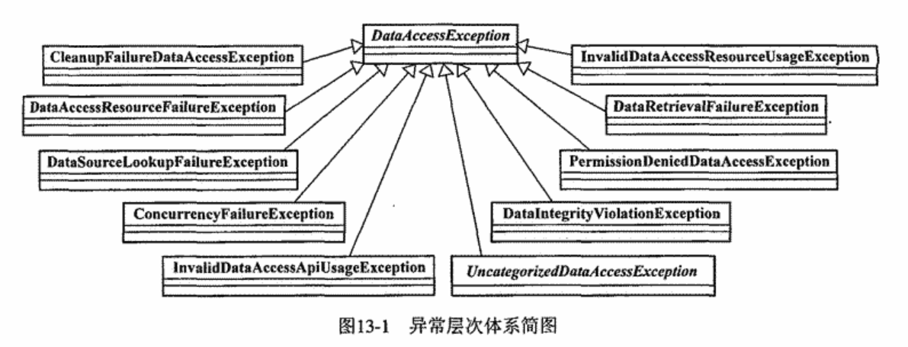

### Chapter 13 统一的数据访问异常体系

 1. 语义完整的异常体系定义
 2. Spring数据访问异常体系
 
 
 ### Chapter 14 JDBC API
 
#### 基于Template的JDBC
 1. 使用```org.springframework.jdbc.core.JdbcTemplate```作为数据访问的**Helper**类
 	- 封装了所有基于JDBC的数据访问代码，以统一的格式和规范使用JDBC API
 	- 对SQLException所提供的异常信息在框架内统一转译，将基于JDBC的数据访问异常纳入Spring自身的异常层次体系

 2.设计模式中**模版方法模式**
- **模版方法模式**使用abstract类定义逻辑结构，并把公共部分在abstract类实现（模版的一部分）
	
```java
	public abstract class JDBCTemplate{
		public final Object execute(String sql){
			//调用
			executeWithStatement()
		}
		
		protected abstract Object executeWithStatement(Statement stmt,String sql);
	}
``` 
- 该章节讨论模版方法提出的问题：模版方法类是抽象类，每次使用都要继承实现新的业务类
- 针对该问题，Spring引入**Callback接口**定义
```java
public interface StatementCallback{
	Object executeWithStatement(Statement stmt);
}

public abstract class JDBCTemplate{
		public final Object execute(StatementCallback callback){
			//调用
			callback.executeWithStatement()
		}
}

/**
* 使用
**/

JDBCTemplate jdbcTemplate=...;
final String sql="update ...";

StatementCallback callback=new StatementCallback(){
	public Object executeWithStatement(Statement stmt){
		return new Integer(stmt.executeUpdate(sql));
	}
}

jdbcTemplate.execute(callback);
```
- Callback接口与模版方法类之间可以看作服务与被服务的关系：模版方法类提供相应资源，Callback使用提供的资源做事，完事之后模版方法类处理资源

3.数据库主键的生成策略
- org.springframework.jdbc.support.incrementer包

4.通过JNDI访问Datasource
- 使用org.springframework.jndi.JndiObjectFactoryBean
- 使用```<jndi:lookup>```查找应用服务器上的DateSource  

5.基于操作对象的JDBC使用方式
- 将查询、更新、调用存储过程封等数据库操作封装为操作对象：
	- SqlQuery
	- SqlUpdate
	- StoredProcedure
- 之前没见，感觉使用场景很少
### Chapter 15 Spring对ORM的集成
### Chapter 16 Spring数据访问之扩展篇
1.HttpClientTemplate
- 使用到Apache Commons HttpClient
2.数据访问中的多数据源——介绍```AbstractRoutingDataSource``` 