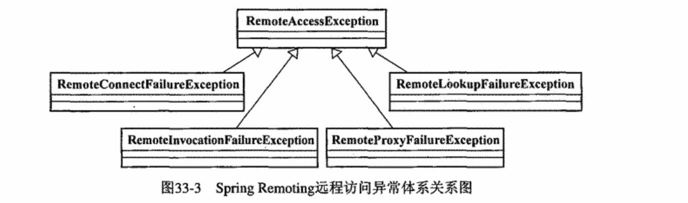
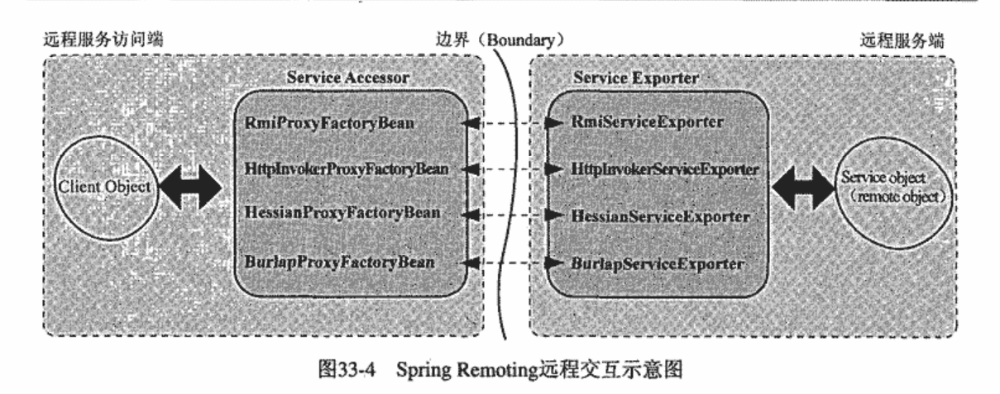
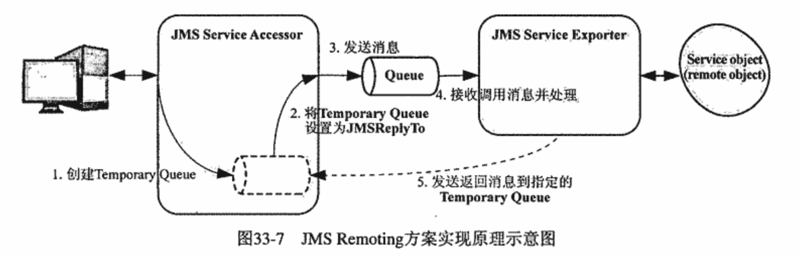
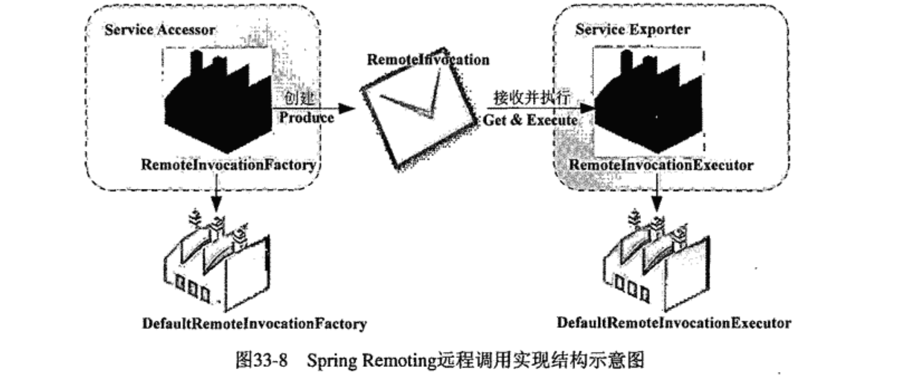

### 1 Spring Remoting架构分析
#### 1.1 远程访问异常体系
顶层 **RemoteAccessException**

#### 1.2 统一风格的公开与访问
- **核心**  Service Exporter和Service Accessor组合

- Service Exporter——负责远程服务对象的公开工作。根据使用的远程机制接受服务请求，然后对请求**解组(un-marshaling)**，根据解组后的请求内容调用本地服务对象(服务器上)。调用完成后，将调用结果重新**编组(marshaling)** 发送到请求客户端。
- Service Accessor——帮助客户端对远程服务对象进行远程访问。客户端发起请求之后，Service Accessor对请求内容编组，根据使用的远程机制对编组后的请求内容发送。接受到Service Exporter返回的调用结果之后，对调用结果解组，并把解组之后的调用结果传给本地客户端。
### 2 基于**RMI**的Remoting方案
- Spring Remoting引入RMI Invoker机制
    - *interface* RmiInvocationHandler
    >Interface for RMI invocation handlers instances on the server, wrapping exported services. A client uses a stub implementing this interface to access such a service.
- 客户端使用```RmiProxyFactoryBean```访问
### 3 基于**HTTP**的轻量级Remoting方案
Spring为各种基于Http的远程方案所提供的Service Exporter实现,都属于另一种类型的Handler——**HttpRequestHandler

- Spring的Http Invoker
    - 公开服务：```HttpInvokerServiceExporter```
    - 访问服务：```HttpInvokerProxyFactoryBean```
- 基于Caucho的**Hessian**方案
    - 在相应的DispatcherServlet就绪之后，只需将HessianServiceExporter添加到ApplicationContext
    - 访问：HessianProxyFactoryBean
- 基于Caucho的**Burlap**方案
    ## Spring 4已经放弃支持
### 4 基于**Web服务**的Remoting方案
## ```org.springframework.remoting.jaxrpc```已废弃，in favor of JAX-WS support in **org.springframework.remoting.jaxws**

对于jaxws:
- 公开服务：SimpleJaxWsServiceExporter
- 访问服务：JaxWsPortProxyFactoryBean
### 4 基于**JMS**的Remoting方案

- 公开服务：JmsInvokerServiceExporter
- 访问服务：JmsInvokerProxyFactoryBean

### 5 SpringRemoting调用实现结构示意图


### 6 JMX